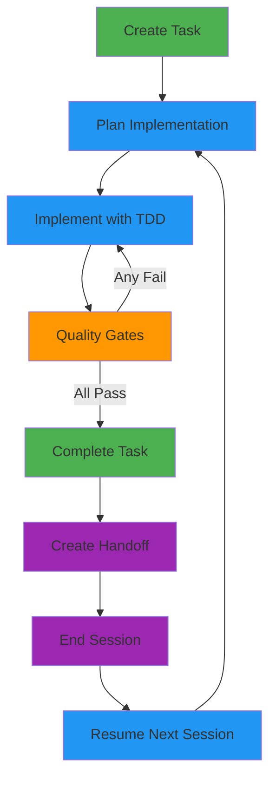
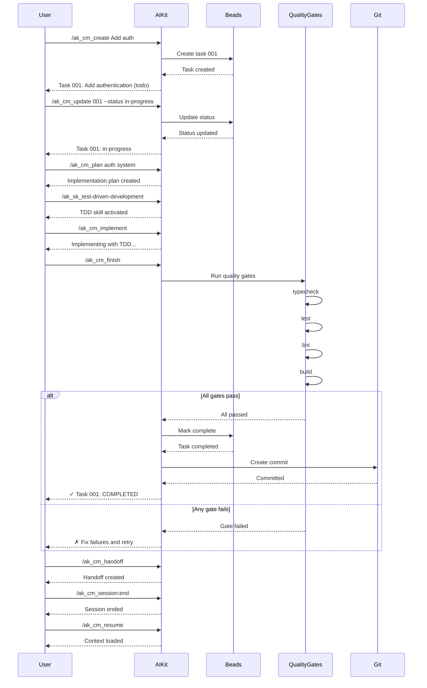

# Beads Workflow

Complete guide to using Beads task tracking with AIKit for structured development workflows.

## Workflow Overview



## Phase 1: Task Creation

### Create Task

Start by creating a new task:

```bash
# Using AIKit command
/ak_cm_create Add user authentication

# Or using Beads directly
bd create "Add user authentication"
```

**This creates:**
- Task file: `.beads/001-add-user-authentication.md`
- Initial status: `todo`
- Auto-generated ID: `001`
- Timestamp: `created` field

### Task Metadata

Set task details:

```bash
# Create with options
bd create "Add user authentication" \
  --type feature \
  --priority high \
  --description "Implement OAuth 2.0 with JWT"

# Edit frontmatter
# Edit .beads/001-add-user-authentication.md
---
id: "001"
title: "Add user authentication"
status: "todo"
type: "feature"
priority: "high"
labels: ["authentication", "security"]
assignee: "developer"
estimated: "4h"
storyPoints: 5
---
```

### Select Task to Work On

Find available tasks:

```bash
# List all tasks
/ak_cm_list

# Filter by status
/ak_cm_list --status todo

# Filter by priority
/ak_cm_list --priority high
```

<MaterialIcon name="info" className="icon-info" /> **Tip:** Use `bd ready` to find tasks ready to start (todo, unblocked).

## Phase 2: Planning

### Update Status

Mark task as in-progress:

```bash
/ak_cm_update 001 --status in-progress
# Or
bd update 001 --status in-progress
```

### Create Implementation Plan

Generate detailed plan:

```bash
/ak_cm_plan user authentication system
```

AIKit will:
1. Ask clarifying questions about requirements
2. Research existing patterns in codebase
3. Break down into 2-5 minute sub-tasks
4. Save plan to `memory/plans/`

**Example plan:**
```markdown
# Plan: User Authentication System

## Sub-Tasks
1. Create authentication models (15min)
2. Implement JWT token service (20min)
3. Add login API endpoint (15min)
4. Add refresh token endpoint (10min)
5. Add token validation middleware (10min)

## Requirements
- User can log in with email/password
- Session is managed via JWT access tokens
- Refresh token mechanism for token renewal
- Token validation on protected routes

## Technical Approach
- Use `jsonwebtoken` library
- Store refresh tokens in httpOnly cookies
- Access tokens expire in 1 hour
- Refresh tokens expire in 7 days
```

### Review Plan

Review generated plan:

```bash
# Read plan from memory
> memory_read("plans/user-authentication")

# Edit if needed
# Edit memory/plans/user-authentication.md
```

## Phase 3: Implementation

### Use Skills for Best Practices

Activate a skill before implementing:

```bash
# Activate TDD skill
/ak_sk_test-driven-development

# Activate debugging skill
/ak_sk_systematic-debugging

# Activate refactoring skill
/ak_sk_refactoring
```

### Implement Task

Execute implementation:

```bash
/ak_cm_implement
```

AIKit will follow skill workflow:

**TDD Workflow:**
1. **RED**: Write failing tests first
2. **GREEN**: Write minimal code to pass tests
3. **REFACTOR**: Clean up code while keeping tests green

**Debugging Workflow:**
1. Identify problem
2. Form hypothesis
3. Test hypothesis
4. Verify fix

### Update Progress

Add progress notes as you work:

```bash
/ak_cm_update 001 --notes "Created authentication models"
/ak_cm_update 001 --notes "Implemented JWT service"
/ak_cm_update 001 --notes "Added login endpoint"
```

### Session Management

Track development across sessions:

```bash
# Start session
/ak_cm_session:start "auth-implementation"

# Add progress notes
/ak_cm_session:update "Implemented JWT token generation"
/ak_cm_session:update "Added login API endpoint"

# End session
/ak_cm_session:end
```

## Phase 4: Quality Gates

### Run Quality Gates

Complete task with mandatory checks:

```bash
/ak_cm_finish
# Or
bd complete 001
```

**Quality gates run:**
1. `npm run typecheck` - TypeScript compilation
2. `npm run test` - All tests pass
3. `npm run lint` - Code linting
4. `npm run build` - Production build

<MaterialIcon name="check_circle" className="icon-success" /> **All gates must pass** for task completion.

### Gate Results

#### All Gates Pass

```bash
/ak_cm_finish

✓ Quality Gates Passed
  ✓ typecheck: No errors
  ✓ test: All tests passing (47/47)
  ✓ lint: No warnings
  ✓ build: Success

Task 001 marked as completed

📦 Git commit created: "Complete task 001: Add user authentication"
```

#### Gate Fails

```bash
/ak_cm_finish

✗ Quality Gates Failed
  ✓ typecheck: No errors
  ✗ test: 2 tests failing
    - test/auth.test.ts:15: Expected 200 but got 401
    - test/auth.test.ts:32: Token validation failed
  ✗ lint: 3 warnings
    - src/auth/jwt.ts:23: Unused variable 'exp'
    - src/auth/middleware.ts:45: Prefer const

Task status remains: in-progress

Fix failures and retry /ak_cm_finish
```

### Fixing Gate Failures

#### Fix Type Errors

```bash
npm run typecheck
# Shows TypeScript errors

# Fix errors
# Edit files...

# Retry
npm run typecheck
```

#### Fix Test Failures

```bash
npm run test
# Shows failing tests

# Use debugging skill
/ak_sk_systematic-debugging

# Fix tests
# Edit tests or implementation...

# Retry
npm run test
```

#### Fix Linting Issues

```bash
npm run lint --fix
# Auto-fixes many issues

# Manual fixes
# Edit files...

# Retry
npm run lint
```

#### Fix Build Errors

```bash
npm run build
# Shows build errors

# Fix build issues
# Edit configuration or code...

# Retry
npm run build
```

### Custom Quality Gates

Configure additional gates in `.aikit/aikit.json`:

```json
{
  "beads": {
    "qualityGates": [
      {
        "name": "typecheck",
        "command": "npm run typecheck",
        "required": true
      },
      {
        "name": "test",
        "command": "npm run test",
        "required": true
      },
      {
        "name": "lint",
        "command": "npm run lint",
        "required": true
      },
      {
        "name": "build",
        "command": "npm run build",
        "required": true
      },
      {
        "name": "e2e",
        "command": "npm run test:e2e",
        "required": false
      }
    ]
  }
}
```

## Phase 5: Completion

### Task Completion

When all quality gates pass:

```bash
✓ Quality Gates Passed
  ✓ typecheck: No errors
  ✓ test: All tests passing
  ✓ lint: No warnings
  ✓ build: Success

Task 001: Add user authentication - COMPLETED

Generated commit message:
"Complete task 001: Add user authentication

- Implement OAuth 2.0 flow
- Add JWT token generation and validation
- Create login and refresh endpoints
- Add token validation middleware

Quality gates:
✓ typecheck: No errors
✓ test: All tests passing (47/47)
✓ lint: No warnings
✓ build: Success"
```

### Update Related Tasks

When a task completes, update related tasks:

```bash
# Unblock dependent tasks
bd update 002 --status in-progress
# Task 002 was blocked by 001

# Update parent task status
bd update 000 --status in-progress
# Parent task has completed child 001
```

### Create Review Document

Generate review document:

```bash
/ak_cm_review
```

Creates `.beads/reviews/001-review.md`:

```markdown
# Review: Task 001 - Add user authentication

## Changes Made
- Created auth models (User, Session)
- Implemented JWT service (generate, validate, refresh)
- Added login endpoint (POST /auth/login)
- Added refresh endpoint (POST /auth/refresh)
- Created token validation middleware

## What Worked Well
- JWT implementation straightforward
- httpOnly cookies improve security
- Clear separation of concerns

## What Was Skipped
- Password reset (deferred to task 003)
- Two-factor authentication (deferred to task 004)
- Social login (deferred to task 005)

## Verification Steps
- [x] Manual testing completed
- [x] All tests passing
- [x] Code review completed
- [x] Security audit passed

## Next Steps
1. Implement password reset (task 003)
2. Add 2FA support (task 004)
3. Implement social login (task 005)
```

## Phase 6: Session Handoff

### Create Handoff

Save progress for next session:

```bash
/ak_cm_handoff
```

Creates `memory/handoffs/[timestamp].md`:

```markdown
---
timestamp: "2026-01-02T17:30:00Z"
duration: "3h 45m"
tasksCompleted: 3
tasksInProgress: 2
gitBranch: "feature/auth"
gitCommits: 5
---

# Handoff: Authentication Implementation

## Completed Work
- [x] Task 001: Add user authentication
  - Implemented OAuth 2.0 flow
  - Added JWT token generation
  - Created login and refresh endpoints
- [x] Task 002: Add token validation middleware
- [x] Task 003: Fix login bug

## In-Progress Work
- [ ] Task 004: Implement password reset
  - Created password reset models
  - Need to implement email sending
- [ ] Task 005: Add session timeout

## Context for Next Session
- Current branch: feature/auth
- Last commit: abc1234 (Fix login validation)
- Working on: Password reset email flow
- Next task: Complete password reset implementation

## Notes
- JWT secrets in .env file
- Email service configured in config
- Need to test refresh token rotation

## Questions for Next Session
1. Should we implement email rate limiting?
2. Refresh token rotation strategy approved?
```

### End Session

Complete session with summary:

```bash
/ak_cm_session:end
```

Generates session summary:

```bash
📊 Session Summary
Duration: 3h 45m
Tasks Completed: 3
Tasks In Progress: 2
Git Commits: 5
Files Modified: 12

Session saved: 2026-01-02-1430-auth-implementation
```

## Phase 7: Resume Next Session

### Load Handoff

Resume work from previous session:

```bash
# Resume latest session
/ak_cm_resume

# Or load specific session
/ak_cm_resume 2026-01-02-1430
```

AIKit loads handoff and context:
- Completed tasks
- In-progress tasks
- Current context
- Next steps

### Continue Work

Continue from where you left off:

```bash
# Load session context
/ak_cm_resume

# Select task to work on
/ak_cm_list --status in-progress

# Update status
/ak_cm_update 004 --status in-progress

# Continue implementation
/ak_cm_implement
```

## Complete Workflow Diagram



## Best Practices

### Task Lifecycle

✅ **DO:**
- Always create task before starting work
- Update status to in-progress when working
- Add progress notes regularly
- Run all quality gates before completing
- Create handoffs when ending sessions

❌ **DON'T:**
- Skip creating tasks for small work
- Leave tasks in limbo (not todo, not in-progress, not completed)
- Complete tasks without running gates
- Forget to create handoffs

### Quality Gates

✅ **DO:**
- Fix all gate failures before retrying completion
- Read gate output carefully for specific issues
- Use skills to fix issues (debugging, refactoring)
- Verify fixes locally before retrying

❌ **DON'T:**
- Skip gates with `--skip-gates` for code tasks
- Retry completion without fixing failures
- Ignore lint warnings or test failures
- Mark tasks complete if gates fail

### Session Management

✅ **DO:**
- Create handoffs when ending sessions
- Include detailed context in handoffs
- List questions for next session
- Resume with handoff to maintain context
- End sessions with summary

❌ **DON'T:**
- End sessions without handoffs
- Lose context between sessions
- Start over every session
- Skip session summaries

## Example Workflows

### Simple Feature

```bash
# Day 1
/ak_cm_create Add contact form
/ak_cm_plan contact form
/ak_cm_implement
/ak_cm_finish

# Day 2
/ak_cm_create Form validation
/ak_cm_implement
/ak_cm_finish
```

### Complex Feature (Multi-Session)

```bash
# Session 1
/ak_cm_session:start "user-auth"
/ak_cm_create Implement user auth
/ak_cm_plan authentication system
/ak_cm_implement
/ak_cm_session:update "Implemented login"
/ak_cm_handoff
/ak_cm_session:end

# Session 2
/ak_cm_session:start "auth-continuation"
/ak_cm_resume
/ak_cm_session:update "Adding refresh tokens"
/ak_cm_implement
/ak_cm_finish
/ak_cm_session:end
```

### Bug Fix

```bash
/ak_cm_create Fix login timeout
/ak_cm_update 001 --status in-progress
/ak_sk_systematic-debugging
# ... debugging and fix ...
/ak_cm_finish
```

### Refactoring

```bash
/ak_cm_create Refactor auth middleware
/ak_cm_update 001 --status in-progress
/ak_sk_refactoring
/ak_cm_implement
/ak_cm_finish
```

## Troubleshooting

### "Task already in-progress"

```bash
/ak_cm_update 001 --status in-progress
# Error: Task already in-progress

# Check current status
bd show 001

# Continue from current status
/ak_cm_implement
```

### "Quality gate keeps failing"

```bash
/ak_cm_finish
# Keeps failing on test gate

# Run tests locally
npm run test

# Use debugging skill
/ak_sk_systematic-debugging

# Fix specific failing tests
# Retry gates
/ak_cm_finish
```

### "Handoff not found"

```bash
/ak_cm_resume
# Error: No handoff found

# List available sessions
/ak_cm_session:list

# Load specific session
/ak_cm_session:show 2026-01-02-1430
```

## Next Steps

- **[Beads Introduction](intro)** - Complete Beads overview
- **[Features](../features)** - All AIKit features
- **[MCP Server](../mcp-server/intro)** - OpenCode integration
- **[Commands Reference](../commands/intro)** - AIKit commands
- **[Session Management](../sessions/intro)** - Session workflows

## Related Links

- [Beads Repository](https://github.com/tdsoft-tech/beads)
- [AIKit GitHub Repository](https://github.com/tdsoft-tech/aikit)
