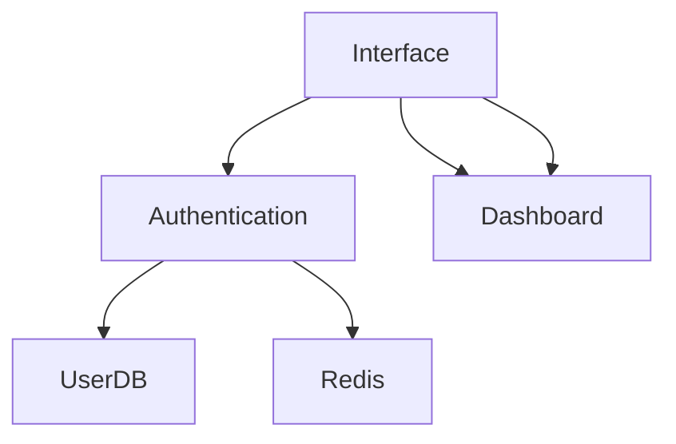

# /ak_cm_design Command

Design architecture, features, or workflows following AIKit design principles.

## Usage

```bash
# Design new feature
/ak_cm_design "User authentication system"

# Design architecture
/ak_cm_design --architecture

# Design workflow
/ak_cm_design --flow
```

## Arguments

| Argument | Type | Required | Default | Description |
|---------|------|----------|-----------|-------------|
| `<description>` | string | Yes | - | Feature or system description |
| `--architecture` | flag | No | false | Focus on architecture only |
| `--flow` | flag | No | false | Create workflow diagram |
| `--database` | flag | No | false | Include database design |
| `--api` | flag | No | false | Include API design |
| `--components` | flag | No | false | List components to design |
| `--async` | flag | No | false | Design asynchronous workflows |

## Workflow

### 1. Requirements Gathering

AIKit will:
1. Ask clarifying questions
2. Understand constraints
3. Identify stakeholders
4. Determine scope

**Questions:**
- What are we designing?
- Who will use this?
- What are the requirements?
- What are the constraints?
- What's the timeline?
- Are there technical constraints?

### 2. Analysis Phase

**Research:**
- Review existing code patterns
- Check architecture for consistency
- Identify integration points
- Research design system if applicable

**Design:**
- Create system architecture
- Design data models
- Define interfaces between components
- Plan for scalability

### 3. Design Phase

**Create:**
- System architecture
- Component structure
- Data flow diagrams
- API endpoints (if applicable)
- Database schemas (if applicable)

**Deliverables:**
- Architecture documentation
- Component specifications
- Interface definitions
- Data flow documentation
- Implementation plan

## Design Artifacts

### 1. Architecture Diagram



### 2. Component Specifications

```typescript
// Component Interface
interface AuthComponentProps {
  onLogin: (email: string, password: string) => void;
  onRegister: (userData: UserData) => void;
  onLogout: () => void;
}

// Component Specification
## Component: Authentication
Type: Functional
Props: See above
Events: onLogin, onRegister, onLogout
State: Managed by AuthContext
Dependencies: API client, auth context
```

### 3. Data Model

```typescript
// Data Models
interface User {
  id: string;
  email: string;
  passwordHash: string;
  createdAt: Date;
  updatedAt: Date;
}

interface AuthToken {
  token: string;
  refreshToken: string;
  expiresAt: Date;
}

interface Session {
  id: string;
  userId: string;
  token: AuthToken;
  createdAt: Date;
  expiresAt: Date;
}
```

### 4. API Endpoints

```
POST /api/v1/auth/register
POST /api/v1/auth/login
POST /api/v1/auth/logout
POST /api/v1/auth/refresh
POST /api/v1/auth/verify
GET /api/v1/auth/me
```

## Examples

### Simple Feature Design

```bash
# Design authentication feature
/ak_cm_design "Add user authentication"

# AIKit will:
# 1. Ask about requirements
# 2. Create authentication flow
# 3. Design components
# 4. Document APIs
```

### Architecture-First Design

```bash
# Design with architecture focus
/ak_cm_design "Authentication system" --architecture

# AIKit will:
# 1. Create system architecture
# 2. Define module boundaries
# 3. Design interfaces
# 4. Plan data flow
```

### Workflow Design

```bash
# Create workflow diagram
/ak_cm_design "Checkout flow" --flow

# AIKit will:
# 1. Define checkout steps
# 2. Create flow diagram
# 3. Document edge cases
# 4. Include error handling
```

## Design Principles

### SOLID Principles

- **Single Responsibility**: Each component has one job
- **Open/Closed**: Modules should be extensible
- **Liskov Substitution**: Dependencies should be swappable
- **Interface Segregation**: Depend on abstractions not implementations
- **Dependency Inversion**: High-level modules shouldn't depend on low-level details

### DRY Principles

- **Don't Repeat Yourself**: Extract common functionality
- **Follow Convention**: Use project patterns
- **Compose Functions**: Build complex behavior from simple parts

### Clean Architecture

- **Separation of Concerns**: Keep business logic separate
- **Clear Layers**: UI, API, data models
- **Minimal Dependencies**: Reduce coupling

## Best Practices

### Before Designing

✅ **DO:**
- Understand existing architecture
- Review similar features
- Consult team members
- Document decisions made
- Plan for scalability
- Consider all use cases

❌ **DON'T:**
- Design in isolation
- Over-engineer for future needs
- Ignore technical constraints
- Create overly complex abstractions
- Skip edge cases

### During Designing

✅ **DO:**
- Iterate on designs
- Get feedback regularly
- Validate assumptions
- Document trade-offs
- Consider implementation

❌ **DON'T:**
- Commit to first design
- Ignore team feedback
- Skip validation
- Design without documentation

### After Designing

✅ **DO:**
- Create implementation plan
- Update architecture docs
- Document design decisions
- Define success criteria

❌ **DON'T:**
- Leave design undocumented
- Make assumptions without noting
- Skip success criteria

## Output Formats

### Markdown Documentation

AIKit generates markdown files with:
- Architecture overview
- Component specifications
- API documentation
- Data flow diagrams
- Implementation plan

### Code Examples

AIKit generates code examples for:
- Component implementations
- API endpoint handlers
- Data models
- Test examples

## Related Commands

- **[/ak_cm_analyze-project](../analyze-project.md)** - Analyze architecture
- **[/ak_cm_review-codebase](../review-codebase.md)** - Review current code

## Related Skills

- **[API Design](../../skills/development/api-design.md)** - API design best practices
- **[Component Design](../../skills/development/component-design.md)** - Component patterns
- **[State Management](../../skills/development/state-management.md)** - State patterns
- **[Database Design](../../skills/design/database-design.md)** - Data modeling
- **[Documentation](../../skills/documentation/documentation.md)** - Design documentation

## Related Documentation

- **[Architecture](../../advanced/memory.md)** - System architecture
- **[Advanced Configuration](../../advanced/configuration.md) - Configuration system
- **[Installation](../../installation.md)** - Setup guide
