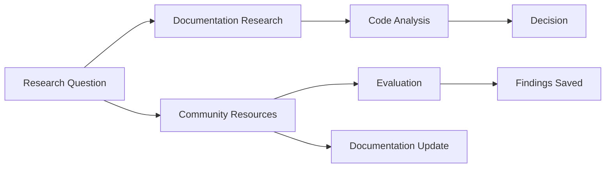

# Research Commands

Research commands in AIKit enable you to gather external information from documentation, code examples, and community resources.

## Available Commands

| Command | Description | Use Case |
|---------|-------------|----------|
| /ak_cm_research | Deep research on a topic with documentation | Learnings, examples, and best practices |
| /ak_cm_analyze-project | Analyze project structure, architecture, and patterns | Understand codebase organization |
| /ak_cm_review-codebase | Review codebase for quality issues, patterns, and improvements | Conduct code review |
| /ak_cm_design | Design architecture, features, or workflows following AIKit design principles |
| /ak_cm_brainstorm | Brainstorm ideas, solutions, or approaches for problems | Generate multiple creative solutions |

## Command Reference

### /ak_cm_research

**See:** [/ak_cm_research](research/research.md)**

### /ak_cm_analyze-project

**See:** [/ak_cm_analyze-project](analyze-project.md)**

### /ak_cm_review-codebase

**See:** [/ak_cm_review-codebase](review-codebase.md)**

### /ak_cm_design

**See:** [/ak_cm_design](design/design.md)**

### /ak_cm_brainstorm

**See:** [/ak_cm_brainstorm](brainstorm.md)**

## How to Use Research Commands

### 1. Define Research Question

```bash
# Clear, specific question
/ak_cm_research "What are JWT best practices for token refresh?"
```

### 2. Execute Research

AIKit will:
- Search official documentation
- Find community resources
- Identify multiple approaches
- Compare solutions
- Document findings with evidence

### 3. Evaluate Options

AIKit provides:
- Comparison table of different approaches
- Pros and cons for each
- Recommendations based on your project context

### 4. Save Findings

Save research to memory for future reference:

```bash
> memory_update("research/jwt-refresh", finded approach: sliding window pattern")
```

## Research Workflow



## Research Categories

### Technical Research

- Library/framework documentation
- API documentation
- Implementation patterns
- Best practices
- Code examples
- Architecture patterns

### Project Research

- Codebase analysis
- Pattern identification
- Architecture review
- Documentation review
- Test coverage analysis

### Market Research

- Competitor analysis
- Industry trends
- Best practices in similar projects
- User needs assessment

## Best Practices

### Before Researching

✅ **DO:**
- Define clear research question
- Set research goals
- Identify authoritative sources
- Note constraints and requirements

❌ **DON'T:**
- Research vague topics
- Skip official documentation
- Use only community resources
- Ignore your project context

### During Researching

✅ **DO:**
- Verify information currency
- Cross-reference multiple sources
- Note publication dates
- Consider project context

❌ **DON'T:**
- Accept first source as truth
- Use outdated information
- Skip critical thinking
- Ignore alternative approaches

### After Researching

✅ **DO:**
- Summarize key findings
- Provide evidence-backed recommendations
- Save to memory for future reference
- Note conflicting information
- Document your reasoning

❌ **DON'T:**
- Leave findings undocumented
- Forget to note conflicting approaches
- Make recommendations without evidence
- Skip follow-up actions

## Related Commands

- **[/ak_cm_analyze-project](../analyze-project.md)** - Analyze project context
- **[/ak_cm_design](../design/design.md)** - Use research for design

## Related Skills

- **[API Design](../../skills/development/api-design.md)** - API documentation
- **[Research](#)` - Research agent
- **[Writing Plans](../../skills/meta/writing-plans.md)** - Plan documentation

## Related Documentation

- **[Tools](../tools/intro.md)** - Research tools
- **[Advanced Configuration](../../advanced/configuration.md)** - Configuration system
